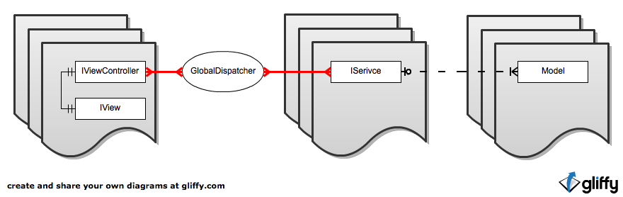

MVC Structure
==========================

View
--------------------------------------
View abstraction is similar to MVC's "View". It contains DisplayObject hierarchy without any logic.
Also, View is mapping Outlets for ViewController. Example of simple View::

	<?xml version="1.0"?>
	<tl:View xmlns:fx="http://ns.adobe.com/mxml/2009" xmlns:tl="http://www.trylogic.ru/" xmlns:local="*" implements="view.testView.ITestView">
		<fx:Script>
			<![CDATA[
			import tl.utils.getChildByNameRecursiveOnTarget;

			private var _someButton : SimpleButton;

			public function get myLabel() : TextField
			{
				return testViewFromSWF.myText;
			}

			protected function get someButton() : SimpleButton
			{
				if ( _someButton == null )
				{
					_someButton = getChildByNameRecursiveOnTarget( "someButton", testViewFromSWF ) as SimpleButton;
				}
				return _someButton;
			}

			private function onSomeButtonMouseDown( e : MouseEvent ) : void
			{
				ITestViewDelegate( controller ).myButtonClicked();
			}

			public function get myAnotherLabel() : TextField
			{
				return testViewFromSWF.myAnotherText;
			}
			]]>
		</fx:Script>

		<tl:addedToStage>
			<![CDATA[
				IEventDispatcher( someButton ).addEventListener( MouseEvent.CLICK, onSomeButtonMouseDown );
			]]>
		</tl:addedToStage>

		<tl:removedFromStage>
		<![CDATA[
				_someButton = null;
				IEventDispatcher( someButton ).removeEventListener( MouseEvent.CLICK, onSomeButtonMouseDown );
			]]>
		</tl:removedFromStage>

		<local:TestViewAsset id="testViewFromSWF" mouseChildren="{ ITestViewDelegate( controller ).canClick }" />
	</tl:View>
	

Where ``view.testView.ITestView`` is::

	package view.testView
	{
		import flash.text.TextField;

		import tl.view.IView;

		public interface ITestView extends IView
		{
			function get myLabel() : TextField;

			function get myAnotherLabel() : TextField;
		}
	}
	

ViewController
--------------------------------------
ViewController is manage all logic for View.
Example of simple ViewController::

	package view.testView
	{
		import actions.FREEZE;

		import flash.text.TextField;

		import tl.viewController.ViewController;

		public class TestViewController extends ViewController implements ITestViewController
		{
			[Outlet]
			public var myLabel : TextField;

			[Outlet]
			public var myAnotherLabel : TextField;

			private var _canClick : Boolean = true;

			public function get canClick() : Boolean
			{
				return _canClick;
			}

			[Bindable]
			public function set canClick(value : Boolean) : void
			{
				_canClick = value;
			}
		
			override public function getViewInterface() : Class
			{
				return ITestView;
			}

			[Event(name="enterFrame")]
			public function onEnterFrame() : void
			{
				var date : Date = new Date();
				myLabel.text = date.getHours() + ":" + date.getMinutes() + ":" + date.getSeconds() + "." + date.getMilliseconds();
			}

			public function myButtonClicked() : void
			{
				canClick = false;
			}
		}
	}

where ``ITestViewController`` is::

	package view.testView
	{
		import tl.viewController.IVIewController;

		public interface ITestViewController extends IVIewController, ITestViewDelegate
		{
		}
	}

and ``ITestViewDelegate`` is::

	package view.testView
	{
		public interface ITestViewDelegate
		{
			function myButtonClicked() : void;

			function get canClick() : Boolean;
		}
	}

Model
--------------------------------------

Each model is a simple IEventDispatcher implementation. Best practice is to annotate class with ``[Bindable]`` metatag. Inject your model where your want to work with.

Service
--------------------------------------

Hello World!